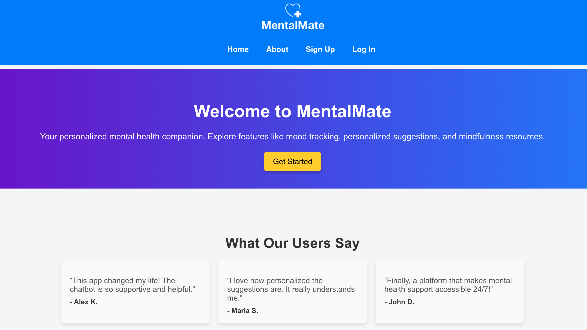
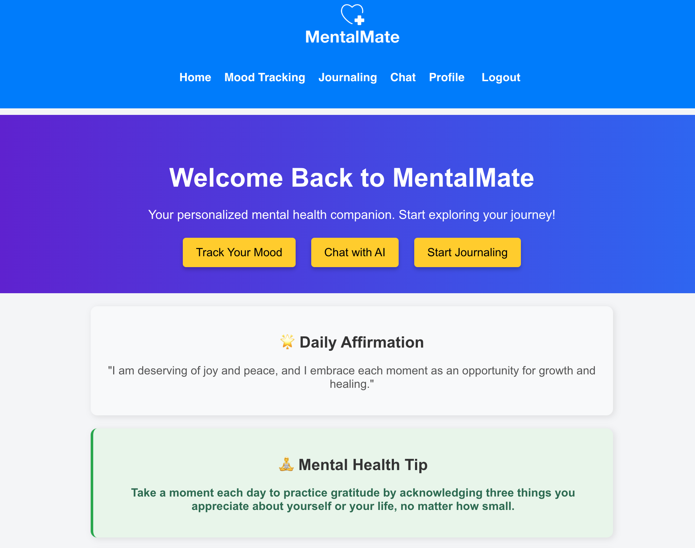
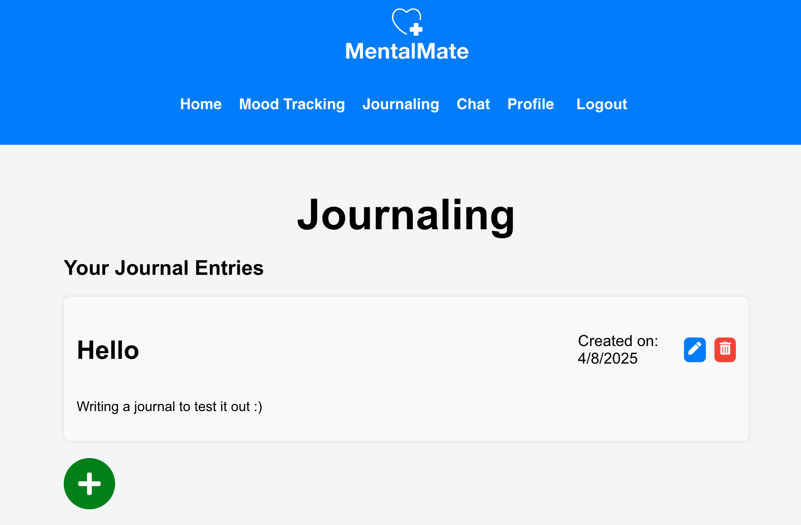
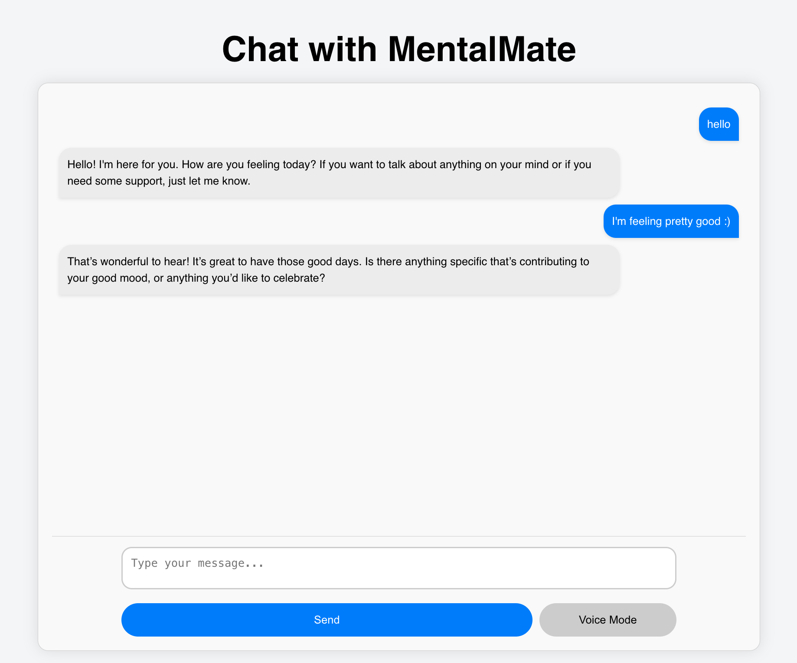
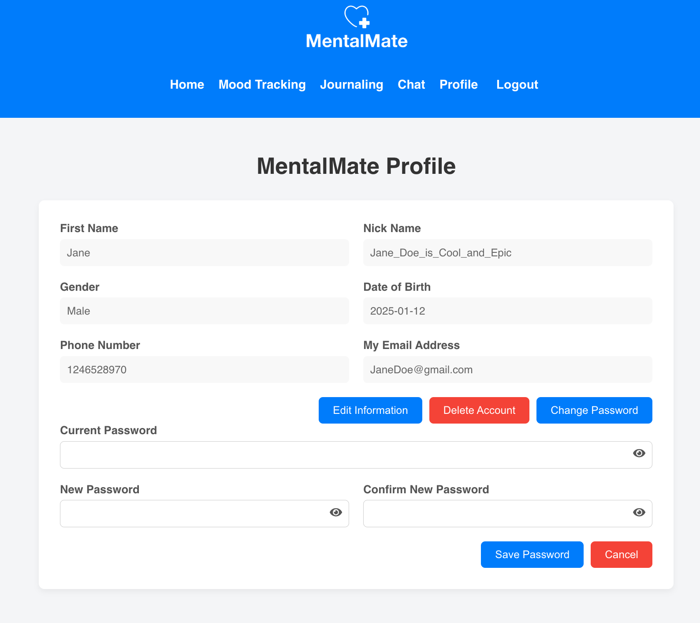

# 🌿 Welcome to MentalMate

<p align="center">
  
</p>

> MentalMate is a personalized mental health chatbot website aimed at creating a supportive environment where users can freely express their emotions and receive constructive feedback. It provides emotional support through AI-powered chatbot interactions, offering users a space to reflect, vent, or seek guidance.

> MentalMate plays an important role in increasing accessibility to mental health support, especially for individuals who may not have immediate access to traditional resources. Whether you're actively seeking mental health support, exploring mindfulness and stress management techniques, or simply curious, MentalMate is designed to be inclusive and accessible to everyone.

---

## ✨ Features

- 🧠 **AI-powered chatbot** for mental health conversations  
- 📅 **Mood tracking** with daily reflections  
- 📓 **Secure journaling** with timestamped entries  
- 🌼 **Daily affirmations** for positivity  
- 📈 **Dashboard** for personal growth insights
In depth explainantions of each feature can be seen by clicking on the feature.

---

## 🚀 Tech Stack

| Frontend  | Backend    | Database | Other         |
|-----------|------------|----------|---------------|
| React     | Node.js    | MySQL    | Express, JWT  |

---

## 🛠️ Installation

In order to run MentalMate, you must have node installed. From there you can install all necessary packages needed to ru the application, including React and its dependencies. 

```bash
# After cloning the repository, cd to the folder
cd mentalmate-project

# Install frontend dependencies
npm install

# Install backend dependencies
cd backend
npm install

#In seperate terminals:
#From the root directory:

#Run the server
cd backend
node server

# Run the client
npm start

```

---

## 🖼️ Preview
Upon running the application, you will be greeted by the main menu:



This serves as a welcome for the user, and allows anyone to get aquainted with MentalMates's features, before logging in. In order to access any of these features you do need to create an account, so none of the features are shown until a user is successfully logged into an authenticated account.


However once a user is logged in, the signed in user now has access to the journaling, mood tracking, and chatbot:



Clicking on any of the features on the navigation bar takes you to their respective windows.

---

## Features: In Depth

### Mood Tracking
> Soon to be updated with picture and description


### Journaling


The journaling feature allows users to create and save personal journal entries linked to their account. Each journal entry consists of a title and the user's written content. When a user saves a journal entry, the date is automatically recorded and displayed whenever the journal is accessed. Users can edit existing entries at any time, or delete them if desired. Before any deletion, a confirmation prompt ensures the user truly intends to remove the entry.


### ChatBot


The ChatBot feature enables users to interact with an AI chatbot designed to support mental health. Users can communicate with the chatbot through text, or optionally through voice if permission is granted. The chatbot responds in both text and voice, and users can switch between the two modes as needed. If any inappropriate or off-topic messages are detected, the chatbot will gently redirect the conversation back to its core purpose: providing mental health guidance, support, and mindfulness tips.


### Profile 


The profile page provides an overview of the user's personal information, including their username, date of birth, and more. Users have the option to update any of their details, except for their email address. If they choose to delete their account, a confirmation prompt will appear to ensure they want to proceed with the deletion.


